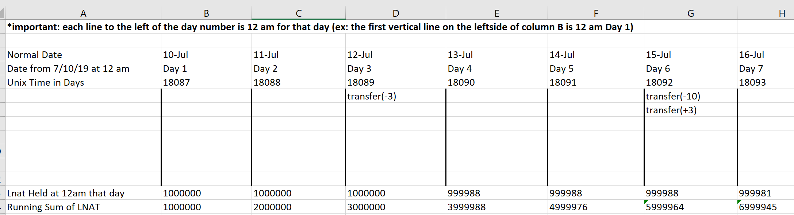

# Understanding the Web3.py Implementation

Web3.py is a python library for interacting with Ethereum.  We will be using this library to interact with the Lendger Crowdfund smart contract once it is put on the Ethereum Mainnet network.

All classes and associated methods meant for interaction with the Lendger Crowdfund smart contract can be found in contractcalls.py under contractcalls.

All classes must be initialized with the smart contract's address and abi, which can be found using the contract address on etherscan.io.  Below are the following classes and their methods that can be used:

## Web3Imp(abi, contractAddress)

Establishes a connection to the ethereum network (local, ropsten, and mainnet) with Infura and creates a contract instance.

Important Variables:

    self._web3main
        - Web3 instance for mainnet network
    self._web3ropsten
        - Web3 instance for ropsten test network
    self._web3local
        - Web3 instance for local test network
    self._coninstancemain
        - Contract instance for mainnet network 
    self._coninstanceropsten
        - Contract instance for ropsten test network
    self._coninstancelocal
        - Contract instance for local test network

## EventListening(abi, contractAddress)

Contains methods for listening to and returning specified event logs.

**Main Function**

    getNewLogs(eventName)

        1. Runs through and returns new logs for a given event (i.e. Transfer).

        2. Looks at database for most recently listened to block and, starting on that block, runs through all the new blocks up to the most recentley mined block on the network.

**Helper Functions**

    getEvent(eventName)

        1. Queries the database for a given event, returning the current and past block from the last time getNewLogs() was called.

    newEvent(pastBlock, currentBlock, eventName)

        1. Creates an entry in the database for an event if there is not one already (corresponds to EventBlock model with 'eventName', 'pastBlock' and 'currentBlock' fields).

        2. Each event should only have one entry and both pastBlock and currentBlock should be set to the block number the contract was created at.

        3. Returns the data entered by the user that was put into the database.

    updateEvent(eventName, pastBlock)

        1. Runs every time getNewLogs() is called and updates the 'pastBlock' and 'currentBlock' fields with the correct block numbers

    runThroughEvents(event, pastBlock, currentBlock='latest')

        1. Loops through a desired range of event logs for a given event and returns a list of logs in dictionary form.  The range is from the parameter pastBlock to currentBlock.

## getLnatHeld(abi, contractAddress)

Contains methods that retroactively calculatates the running sum of LNAT a user held at any given time.

Every person's running sum is initially 0 and is stored in the database.  Everyday at 12 am GMT, a user's LNAT balance is retrieved, representing how much LNAT they hold for that day (refer to picture below for clarity).  The running sum for that user is then retrieved from the database and then their balance is added to the running sum.  The running sum gets stored back into the database but with the new updated value.  This process is repeated everyday at 12 am GMT.

If their balance changes that day, nothing will happen to the current running sum until 12 am GMT the following day.  At this time the balance, whether it changed or not, is added to the running sum.

Below is an example:

**Main Function**

    LnatHeld(user, days)

        1. Calculates the running sum of LNAT token a user holds at a specified time (so many days ago).

        2. Takes the difference between the two times calculated with the LNATDifferenceOverTime() method and subtracts that from the current running sum of LNAT to get the above.

        3. i.e. LnatHeld(user_address, 4) retrieves the running sum amount of LNAT a specified user held four days ago. 

**Helper Functions**

    getLnatCount(user)

        1. Queries the database for a given user, returning the current running sum of LNAT they hold, the timestamp (days in Unix Time) for when the user had this running sum balance, and the user address. 

    newLnatCount(user)

        1. Called when a user's running sum of Lnat is not yet stored in the database (corresponds to the LnatSum model stored in the database with the fields 'lnatHeld', 'dayNumber', and 'userAddress'.)

        2. Each user should only be entered once in the database.

    updateLnatCount(user)

        1. Called every 24 hours at 12 am GMT.  This is the act of updating the current running sum of a given user by taking their current balance and adding it to the running sum.

    LNATDifferenceOverTime(user, days)

        1. Called by LnatHeld() to calculate the difference between the running sum of Lnat held currently and the running sum of Lnat held at a given time (so many days ago, similar to days parameter in LnatHeld())

        2. Looks at any 'Transfer' events that occured between these two dates for specified user and adds or subtracts any Lnat transfered to or from a given user's balance.  This is the retroactive part.  

 

## LendgerCrowdfund(abi, contractAddress)

Enables external functions from the Lendger Crowdfund smart contract to be called.  

As an example, to call ToggleKYC():

    x = LendgerCrowdfund(abi, contractAddress)
    x.toggleKYC(userAddress)

